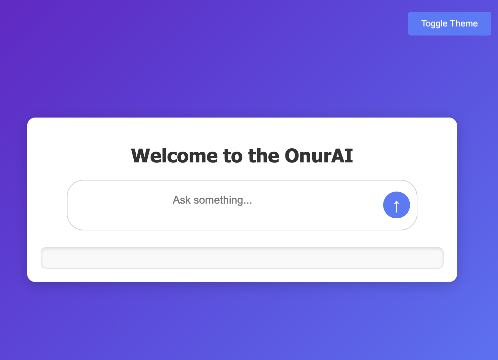

# OnurAI Chat Application

A simple Flask-based web application that interacts with the Groq API to provide real-time responses to user queries. Users can type their questions, and the application will display the response from the Groq API.

## Features

- **Real-time Chat Interface:** Users can type their questions and get instant responses.
- **Enter Key Support:** Pressing the Enter key automatically submits the query.
- **Modern UI:** A clean and professional design with a responsive layout.
- **Easy Deployment:** Ready to deploy on platforms like Render with minimal configuration.

## Technologies Used

- **Flask:** A lightweight Python web framework.
- **Groq API:** Used to fetch responses for user queries.
- **HTML/CSS:** For the front-end design and layout.
- **JavaScript:** For handling user interactions and API requests.
- **Render:** For deploying the application.

## Getting Started

### Prerequisites

- Python 3.7 or higher
- A Groq API key (you can get one from [Groq Console](https://console.groq.com/))
- Git (for version control and deployment)

### Installation

1. **Clone the Repository:**
   ```bash
   git clone https://github.com/your-username/groq-chat-app.git
   cd groq-chat-app
   ```

### Set Up a Virtual Environment:

python -m venv venv
source venv/bin/activate # On Windows, use `venv\Scripts\activate`

### Install Dependencies:

pip install -r requirements.txt

### Set Environment Variables:

Create a .env file in the root directory and add your Groq API key:
GROQ_API_KEY=your_api_key_here

### Run the Application:

Running the Application Locally
Start the Flask Development Server:

bash

python3 app.py

Access the Application:

Open your browser and go to http://127.0.0.1:5001.

### Project Structure

OnurAI-Chat/
│
├── app/
│ ├── templates/ # HTML templates
│ │ └── index.html # Main chat interface
│ ├── **init**.py # Main Flask application
│ ├── models.py # Database models
│ ├── routes.py # API routes and views
│ ├── utils.py # Utility functions
│
├── static/ # Static files (CSS, JS, images)
│ ├── js/
│ │ └── script.js # JavaScript logic
│ ├── css/
│ │ └── style.css # Custom styles
│
├── run.py # Entry point for running the app
├── requirements.txt # Python dependencies
├── Procfile # Deployment configuration for Render
├── .env # Environment variables (not in version control)
└── .gitignore # Files to ignore in Git
